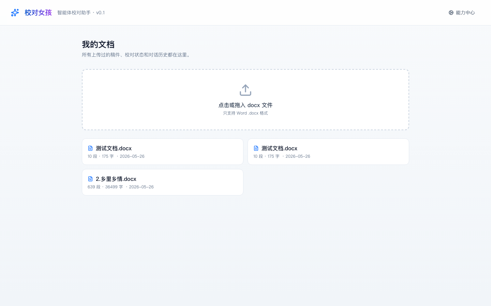
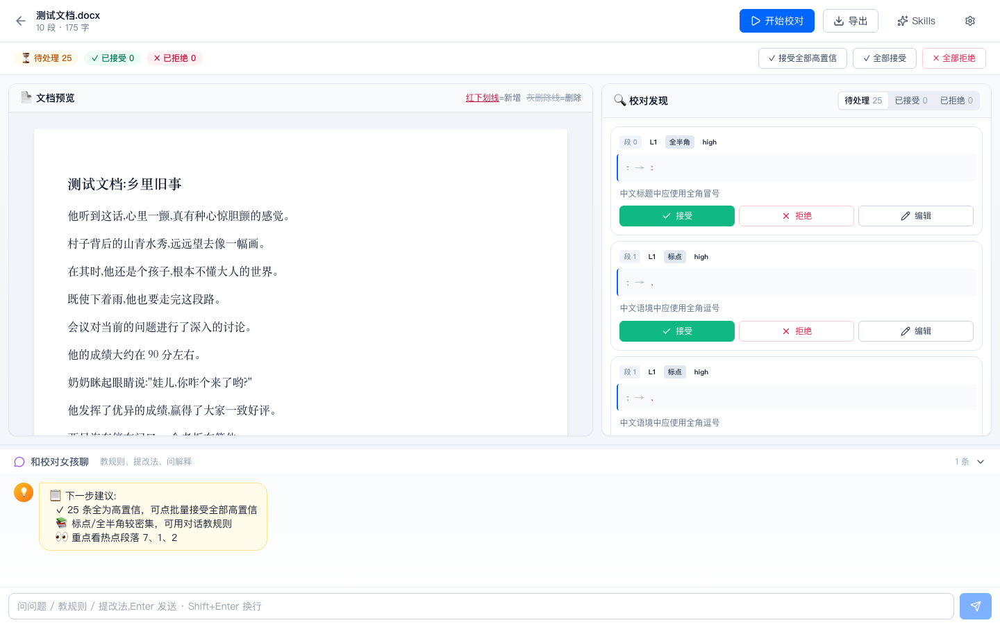
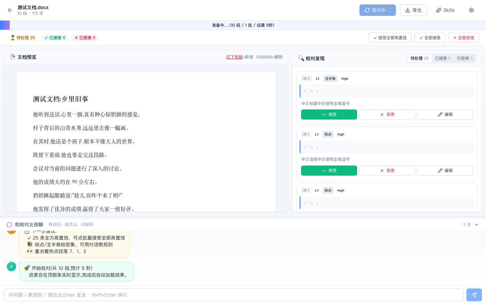
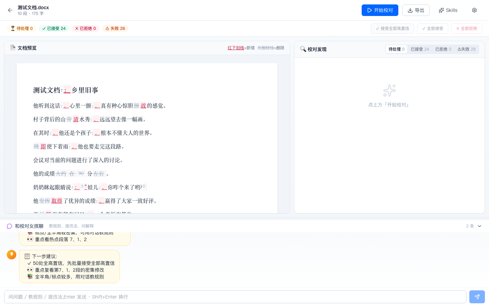
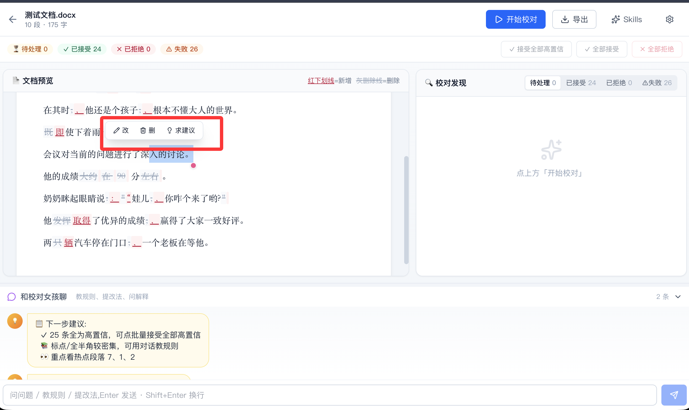
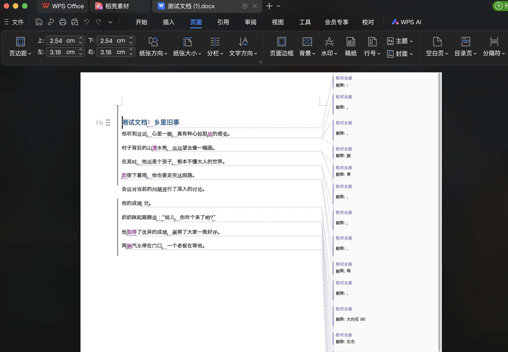
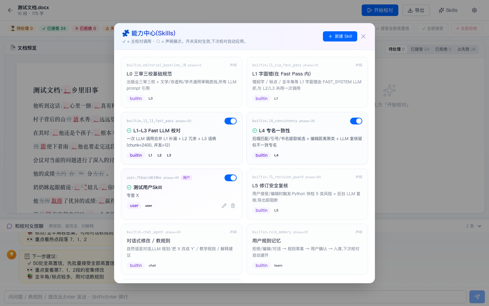
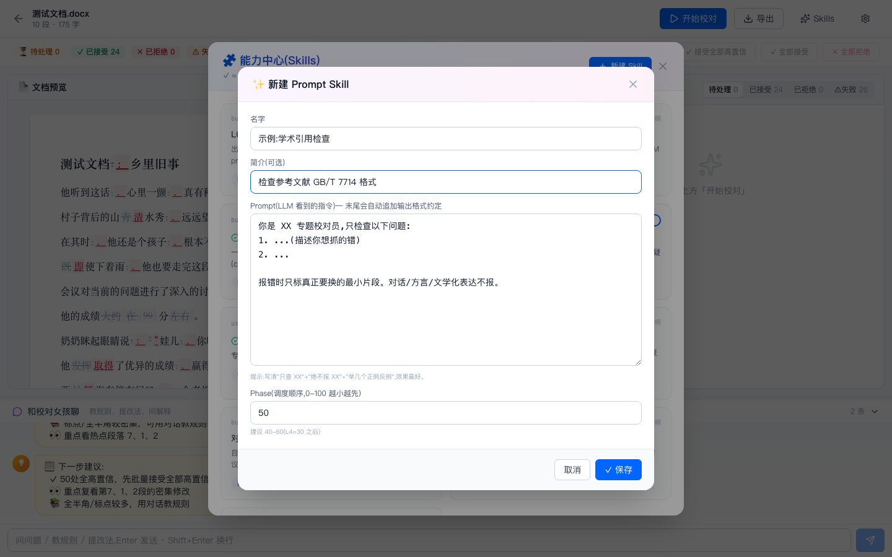
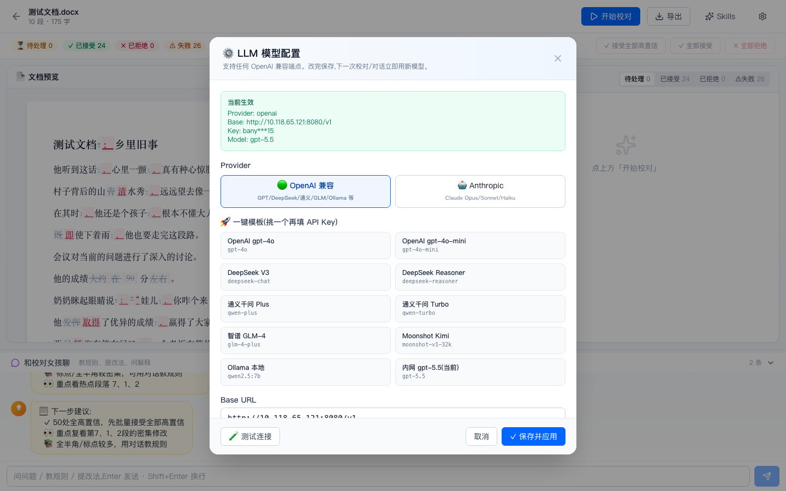

# 校对女孩 · editgirl

> 中文图书校对智能体 — L1-L5 分层校对,可插拔 Skill 架构,Word 原生 track changes,前端可切换 LLM 模型(OpenAI / Anthropic / DeepSeek / 通义千问 / GLM / Ollama 等)。

[](LICENSE)
[](https://www.python.org/)
[](https://nodejs.org/)
[](https://fastapi.tiangolo.com/)
[](https://react.dev/)

---

## ✨ 核心特性

- **🎯 L1-L5 分层校对** — L0 出版规范 + L1-L3 Fast Pass + L4 专名一致性 + L5 修订安全复核
- **🧩 可插拔 Skill 架构** — 前端直接创建新 Skill,无需写代码
- **🤖 多 LLM Provider 支持** — OpenAI 兼容(GPT/DeepSeek/通义/GLM/Kimi/Ollama)+ Anthropic Claude
- **🎨 前端动态配置** — 模型/Skill 开关无需重启,实时生效
- **📝 Word 原生修订** — track changes(`<w:ins>`/`<w:del>`)写入 Word,最小化 diff 标注
- **💡 智能化体验** — 选中文字浮动工具栏、对话式修改、规则自学、智能推荐
- **📚 多会话管理** — 历史文档列表 + 对话历史持久化

## 📸 界面预览

**主页 — 历史文档列表 + 拖入上传:**



**编辑页(刚加载)— 顶栏一行按钮 + 左 docx 预览 + 右 findings 区 + 底部聊天:**



**校对中 — 顶部进度条 + 右侧实时出现 findings 卡片 + 底部智能推荐:**



**接受修订后 — docx 预览出现红下划线(新增)/灰删除线(删除),状态条更新:**



**接受修订后 — 可以自定义选择文本变更:**


**对话框对话变更 — 选中 findings 卡片点 [对话修改],和 AI 聊天讨论后直接应用:**


**word最终导出 — 只允许没有 pending L5 的文档导出,确保修订安全:**


**🧩 Skills 弹窗 — 实时开关每个能力,一键 + 新建:**



**✨ 新建 Prompt Skill — 填名字 + prompt 即可,无需写代码:**



**⚙ LLM 模型配置 — Provider 切换 + 13 个一键预设(OpenAI/Anthropic/DeepSeek 等):**



## 🚀 快速开始

### AI用户极速版指令
```text
把下面这句话丢给你的智能体，OpenClaw、Trae、ClaudeCode、Cursor都可以，亲测可用！！！！！
指令：请帮我在本地部署这个项目，git地址：https://github.com/zty-f/editgirl 部署完成后直接打开就行。
```

### 前置要求

- Python 3.11+
- Node.js 22+ / npm 10+
- 一个 LLM 服务(OpenAI / Anthropic / DeepSeek 任一即可)

### 正常安装使用指令

```bash
# 1. 克隆
git clone https://github.com/<your-org>/editgirl.git
cd editgirl

# 2. 后端依赖
python3 -m venv .venv
.venv/bin/pip install -e backend/

# 3. 前端依赖
cd frontend && npm install && cd ..

# 4. 配置 LLM(任选其一,前端也能改)
cp backend/.env.example backend/.env
# 编辑 backend/.env 填入 OPENAI_BASE_URL / OPENAI_API_KEY / LLM_MODEL
```

`backend/.env.example` 已经包含 7 种主流 provider 的注释模板,任选一个取消注释即可。

### 运行

```bash
./start.sh
```

打开 http://localhost:5173,开始用。

- 前端 UI:http://localhost:5173
- 后端 API + 自动文档:http://localhost:8000/docs

`Ctrl+C` 一起关。改后端代码需重启;改前端代码 Vite HMR 自动应用。

#### [测试文档.docx](backend/tests/fixtures/%E6%B5%8B%E8%AF%95%E6%96%87%E6%A1%A3.docx)

## 🏗️ 项目结构

```
editgirl/
├── backend/                       # Python + FastAPI
│   ├── app/
│   │   ├── main.py                # FastAPI 入口
│   │   ├── schemas.py             # Pydantic + Skill / SkillContext
│   │   ├── core/                  # config + SQLite store
│   │   ├── api/routes.py          # REST + WS endpoints
│   │   ├── services/              # 校对引擎、prompts、LLM client
│   │   └── skills/                # 内置 Skill(可扩展)
│   └── tests/
├── frontend/                      # Vite + React + TS + Tailwind
│   └── src/
│       ├── pages/                 # Home / Doc / Skills
│       ├── components/            # 复用组件
│       └── lib/api.ts             # API client + 类型
├── start.sh                       # 一键启停
├── README.md
└── LICENSE
```

## 🎯 校对流程(L1-L5)

| 层 | 实现 | 触发 |
|---|---|---|
| L0 三审三校规范 | 嵌入 FAST prompt | 自动 |
| L1 字面错(成语/标点/全半角) | LLM 在 FAST pass 抓 | 主校对 |
| L2 冗余精修(用词重复/拗口) | LLM 在 FAST pass 抓 | 主校对 |
| L3 语病(主谓/动宾/量词) | LLM 在 FAST pass 抓 | 主校对 |
| L4 专名一致性 | Python 候选 + 编辑距离聚类 + LLM 复核 | 主校对自动 |
| L5 修订安全复核 | Python 快检 + 后台 LLM 复核 | 接受时自动 |
| 导出阻断 | 有 pending L5 拒绝导出 | 导出时 |

## 🧩 加新 Skill — 前端 UI 操作,无需代码

在编辑页顶栏点 **✨ Skills** 按钮 → **+ 新建 Skill**,弹窗里:

1. **名字**:给你的 skill 起个名,如「小说人物口吻一致」
2. **简介**:一句话说明
3. **Prompt**:写一段 LLM 系统指令,描述你想抓什么错。例:
   ```
   你是小说校对员,只检查人物对话口吻是否前后一致。
   报错时只标真正要换的最小片段。其他问题一律不报。
   ```
4. **Phase**:调度顺序,默认 50(L1-L3 是 20,L4 是 30,建议 40-60)

点 **✓ 保存**,**立即生效**,下次校对自动应用。

**Skills 弹窗里还能:**
- 开关每个内置 / 用户 Skill(实时生效,不用重启)
- 编辑 / 删除已创建的 Prompt Skill
- 查看每个 Skill 的 layers、scope 和调度顺序

## 🤖 切换 LLM 模型

前端点顶栏 **⚙** 按钮,Provider 切换 + 13 个一键预设:

- OpenAI gpt-4o / gpt-4o-mini
- Anthropic Claude Opus 4.7 / Sonnet 4.6 / Haiku 4.5
- DeepSeek V3 / Reasoner
- 通义千问 Plus / Turbo
- 智谱 GLM-4
- Moonshot Kimi
- Ollama 本地
- 自建 vLLM / llama.cpp(填 base_url 即可)

🧪 测试连接 → ✓ 保存即用,**不重启**。也可改 `backend/.env` 然后重启。

## 📡 API 概览

| 类别 | Endpoints |
|---|---|
| 文档 | `GET/POST/DELETE /api/documents` · `GET /api/documents/{id}/preview` · `GET /api/documents/{id}/download` |
| 校对 | `POST /api/documents/{id}/proofread` · `POST /api/documents/{id}/export` |
| 修订操作 | `POST /api/errors/{eid}/{accept\|reject\|undo}` · `POST /api/documents/{id}/batch_{accept\|reject}` |
| 直改 / 候选 | `POST /api/documents/{id}/direct_change` · `POST /api/documents/{id}/suggest_alternatives` |
| 对话 | `POST /api/documents/{id}/chat` · `GET /api/documents/{id}/messages` |
| 规则 | `GET /api/rules` · `GET /api/rule_candidates` · `POST /api/rule_candidates/{id}/{approve\|archive}` |
| Skill | `GET /api/skills` · `PATCH /api/skills/{id}` · `POST/PUT/DELETE /api/user_skills` |
| 配置 | `GET/PUT /api/settings` · `POST /api/settings/test` |
| WS | `/api/ws/{id}` (进度推送 + 智能推荐) |

完整 OpenAPI 文档:启动后访问 http://localhost:8000/docs

## 🛠️ 技术栈

**后端**
- FastAPI · Pydantic v2 · SQLite
- python-docx + docx-revisions (Word track changes)
- OpenAI SDK + Anthropic SDK
- asyncio 并发调度

**前端**
- Vite + React 19 + TypeScript
- Tailwind CSS + lucide-react icons
- React Router 7

## 🔒 数据 & 隐私

- **单机工具**,所有数据存本机 `backend/data/editgirl.db`
- 上传的 docx 在 `backend/data/uploads/`,工作副本在 `backend/data/work/`
- 删除文档时**连带物理文件清理**
- LLM API Key 存 SQLite,前端展示时遮罩
- **不收集任何遥测数据,不上传任何内容到第三方**(只发到你配的 LLM)

## 🤝 贡献

欢迎 PR!核心方向:
- 新 Skill(学术引用 / 法律合规 / 古文校对...)
- 新 LLM Provider 适配
- 评测脚本 / 召回率测试
- UI/UX 改进

## 📄 License

[MIT](LICENSE) © 2026 editgirl contributors
